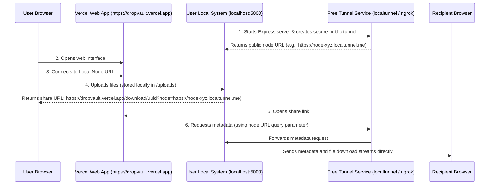

# Architecture: Web Frontend + Local User Backend

To achieve a web-based frontend (hosted on the internet) where the files are stored and served directly from the user's own system, we use a **Local Node + Secure Tunneling** architecture. 

This is the exact method used by professional developers to build decentralized or local-first web applications.

---

## The Architecture Diagram



---

## How to Implement It (Step-by-Step)

### Step 1: Automate Secure Tunneling in the Backend

We can add `localtunnel` (a free, open-source tunneling library with zero signup required) directly to our backend dependencies.

1. Install it in the `backend/` folder:
   ```bash
   npm install localtunnel
   ```
2. Update `backend/server.js` to automatically create a tunnel when it runs:
   ```javascript
   import localtunnel from 'localtunnel';

   const PORT = 5000;
   
   app.listen(PORT, async () => {
     console.log(`DropVault local node running on port ${PORT}`);
     
     try {
       // Open secure tunnel pointing to our local port
       const tunnel = await localtunnel({ port: PORT });
       console.log(`DropVault public secure tunnel node active at: ${tunnel.url}`);
       
       // Save tunnel URL in database or metadata so we know the node's URL
       app.set('tunnelUrl', tunnel.url);
       
       tunnel.on('close', () => {
         console.log('Tunnel closed.');
       });
     } catch (err) {
       console.error('Failed to start public secure tunnel:', err);
     }
   });
   ```

### Step 2: Make the Frontend Node-Aware

In `src/App.jsx`, instead of hardcoding `http://localhost:5000` as the API server, the frontend should dynamically determine the API target:

1. **Local storage check:** If the uploader is using the web app, let them enter their local backend URL (or default to `http://localhost:5000`).
2. **Query parameter check:** If a recipient opens a download link, read the node URL from the query parameter:
   ```javascript
   // Determine API Base URL
   const getApiBase = () => {
     // Check if we are on a download page and have a "node" URL in parameters
     const params = new URLSearchParams(window.location.search);
     const nodeParam = params.get('node');
     if (nodeParam) {
       return `${nodeParam}/api`;
     }
     
     // Otherwise, check if user has custom local port saved
     const savedNode = localStorage.getItem('dropvault_node_url');
     return savedNode ? `${savedNode}/api` : 'http://localhost:5000/api';
   };
   ```

### Step 3: Run the Backend Locally

The user runs the backend locally on their machine (using a simple packaged script, Docker, or `npx dropvault-backend`), which starts the server and logs the public secure tunnel URL. 

They can now open the Vercel-hosted link, enter their local node URL once, and use the website normally. All files stay fully controlled on their local computer!
